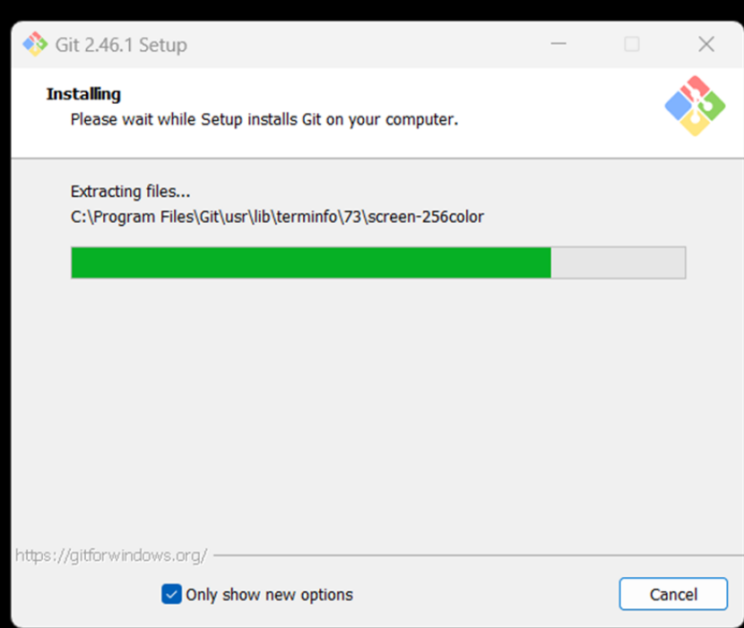
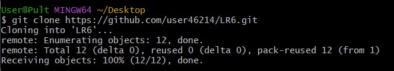
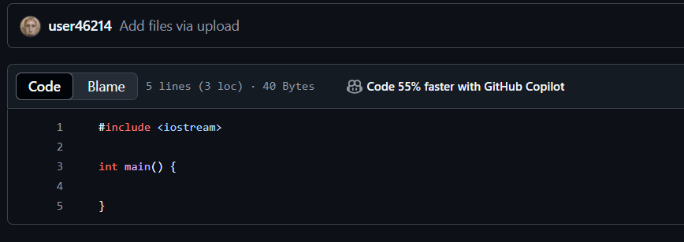
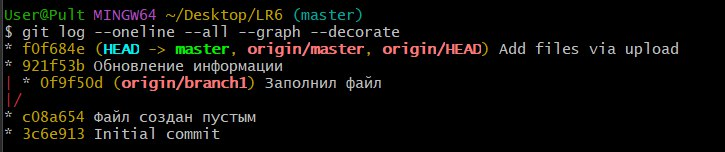
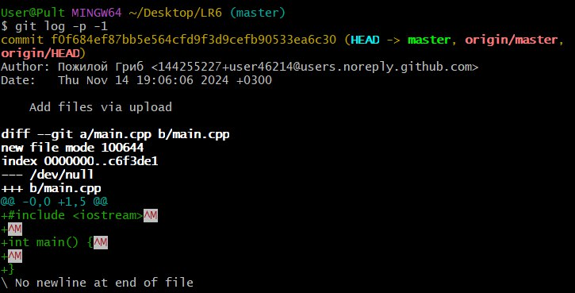
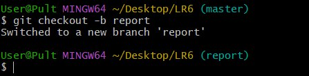

# LR6
Лабораторная работа №6

# Отчет по работе с Git

## 1. Создание форка

## 2. Установка Git
*Скриншот с процессом установки git*  


## 3. Изменение имени пользователя и группы
Команда для изменения имени пользователя:

```bash
$ git config --global user.name "4317 Фёдоров И.А."
```

## 4. Клонирование репозитория
*Скриншот с процессом клонирования*  


```bash
$ git clone https://github.com/user46214/LR6
```

## 5. Добавление нового файла
*Скриншот с добавлением нового файла*


## 6. Добавление изменений в локальный репозиторий

```bash
$ git pull
```

## 7. Получение данных для каждой из веток

```bash
$ git log --all –oneline --graph --decorate
```

*Результат работы команды*



## 8. Просмотр последних изменений

```bash
$ git log -p -1
```

*Результат работы команды*



## 9. Решение конфликта и слияние веток

```bash
$ git checkout master
$ git marge branch1
```
Решение конфликта путем замены содержимого mergefile.txt в ветке branch1

## 10. Удаление побочной ветки после слияния

```bash
$ git branch -d branch1
```

## 11. Откат коммита
Посмотреть логи с помощью команды:

```bash
$ git log --all –oneline
```

Откат к предыдущему коммиту:

```bash
$ git reset --hard b51a1dd
```

## 12. Создание ветки для отчета

```bash
$ git checkout -b report
```
*Скриншот с созданием новой ветки*


## 13. Получение истории операций в форматированном виде

```bash
$ git log --pretty=format:"%h %ad %an %s" --date=short
```

## 14. История операций
Список истории операций:
b03bc9c 2024-11-14 4317 Фёдоров И.А. Продолжение создания отчета
04449c8 2024-11-14 4317 Фёдоров И.А. Создание отчета
75807c0 2024-11-14 4317 Фёдоров И.А. Создание папки скриншотов

